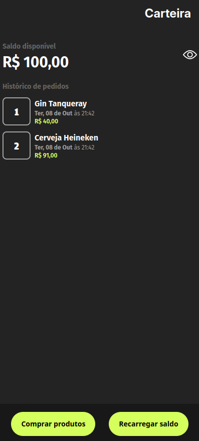
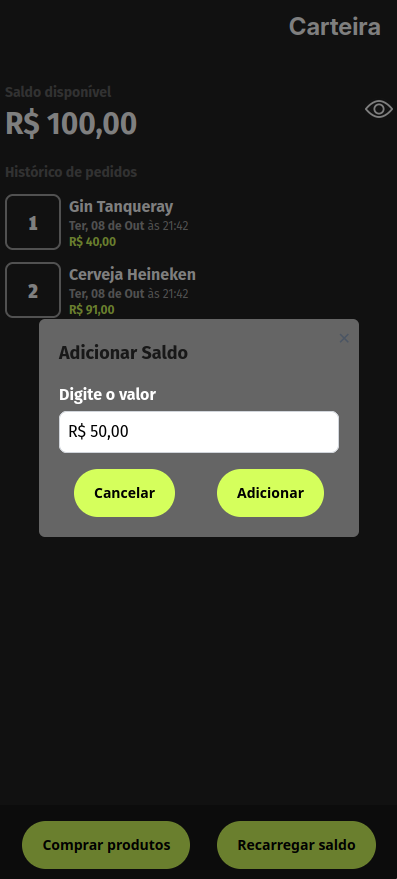
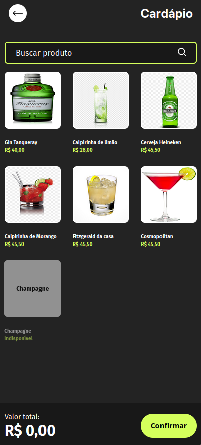
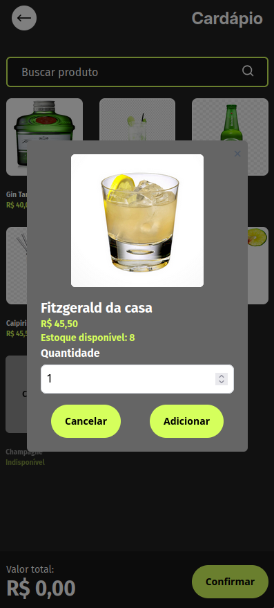
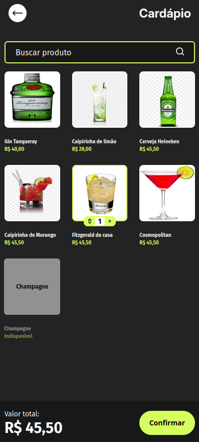
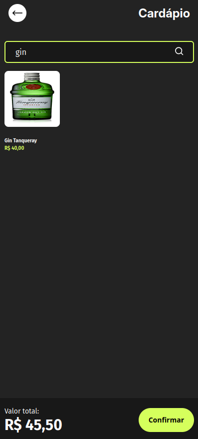
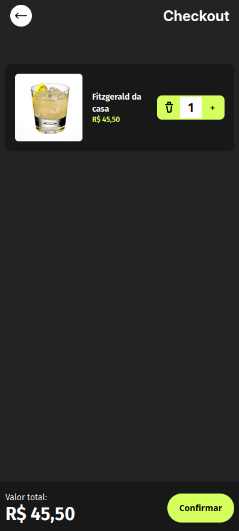
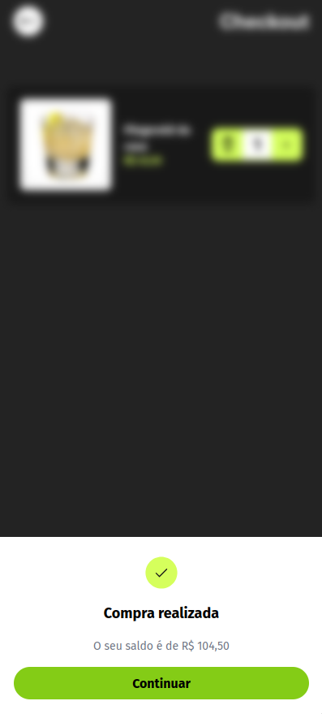
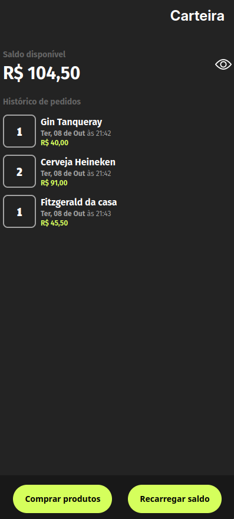

## Desafio Gandaya Checkout - Yago

Neste desafio, montei um repositório simulando uma aplicação de checkout real. O repositório está organizado da seguinte forma:

- A pasta `client` contém o front-end em React, com Tailwind CSS e TypeScript.
- A pasta `docker` contém o arquivo `docker-compose.yml` para a inicialização do MySQL em um container Docker.
- A pasta `server` contém o back-end utilizando Node.js com Express e Prisma como ORM.

### Como executar

Para rodar a aplicação localmente, siga os seguintes passos:

```bash
# Inicialize o front-end
cd client
npm install
npm run dev

# Inicialize o banco de dados MySQL com Docker
cd docker
docker compose up

# Inicialize o back-end
cd server
npm install
npx prisma generate
npm run dev
```

Após a execução desses comandos, a aplicação estará rodando nas seguintes URLs:

- Front-end: [http://localhost:3000](http://localhost:3000)
- Back-end: [http://localhost:3001](http://localhost:3001)


### Imagens de Referência

As imagens abaixo mostram o fluxo da aplicação e o layout esperado para diferentes telas e funcionalidades.

#### Carteira

As imagens 01 a 03 referem-se à **Carteira**, onde o usuário pode visualizar o saldo atual e o histórico de compras, além de poder **adicionar saldo** à conta.




#### Menu

As imagens 04 a 07 referem-se ao **Menu**, onde o usuário pode navegar pelos produtos, selecionar itens, adicionar ou remover do carrinho, e ver os detalhes dos produtos disponíveis.







#### Checkout

As imagens 08 a 10 mostram o fluxo de **Checkout**, onde o usuário pode finalizar a compra, visualizar o valor total da transação, ajustar quantidades e, após a compra, voltar à tela da **Carteira**.






Time Checkout 🛒✨
```
